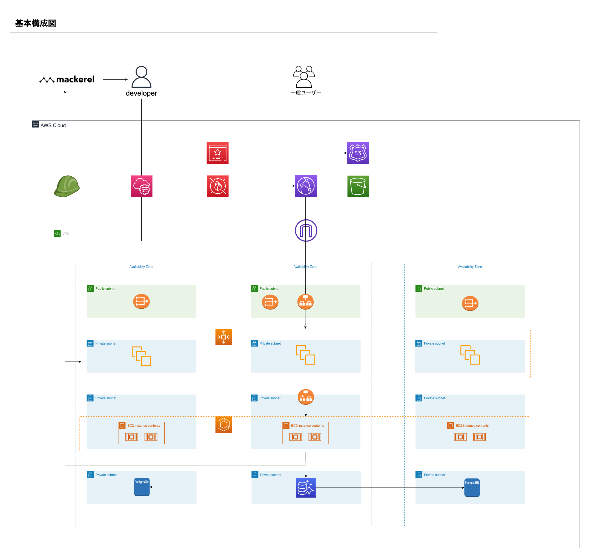

# aws-web-service-architecture

## 概要

:warning: 作成中です。

AWSでWEBサービスを構築する際の一例です。  
個人・スタートアップ向けではないので、使用料金はある程度かかる設計内容です。

## 構成図

### 検索処理

### ログ運用

### 監視

### パフォーマンス管理

### CI・CD

### ブラウザテスト

### セキュリティ

### 料金通知
