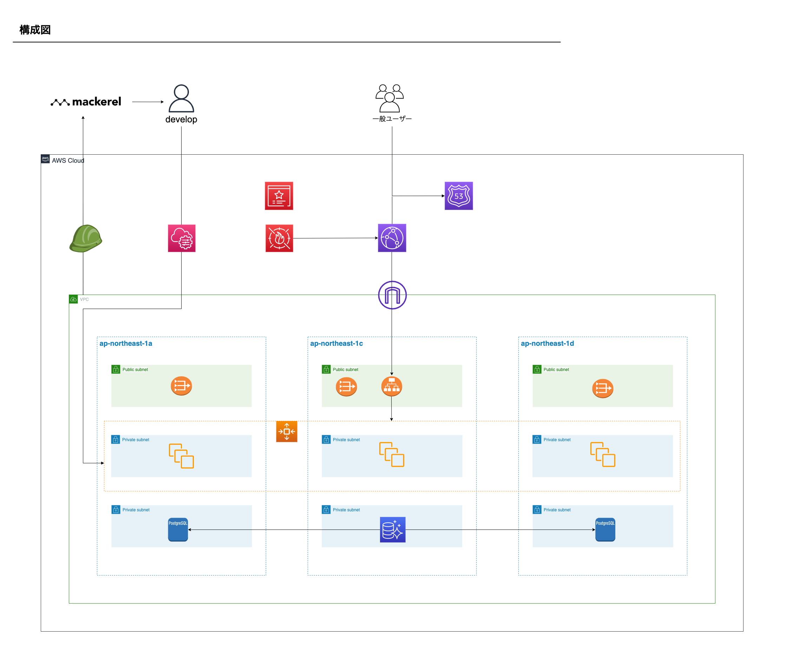

# aws-web-service-architecture

## 概要

AWSでWEBサービスを構築する際の一例を作ってみました。  
個人・スタートアップ向けではないので、使用料金はある程度かかる設計内容です。

## 構成図

## 補足

ログ格納先やバッチ処理環境、検索処理等でElasticsearchを使うなどの細かい要件はとりあえず置いておきます。  
(きりがないので・・・)
